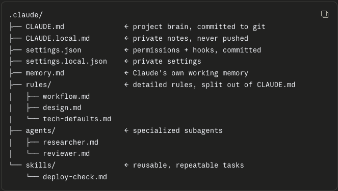

Most people learn Claude Code the same way. You install it, run it in a folder, ask it to fix a bug, and it works. Great. Then a month later you're 80% through your context window on a Tuesday night, Claude has forgotten the architecture decision you made an hour ago, and you're burning tokens re-explaining your own project.

The gap between "Claude Code works" and "Claude Code works *well*" isn't about better prompts. It's about three things: how you manage context, how you hand off between sessions, and whether you picked the right interface for the job.

This is what I've learned running it daily on Python and Django projects, written down so I can find it again.

## Part 1 — What Claude Code Actually Is (And Where It Runs)

Claude Code is an agentic coding tool. Not autocomplete — an agent that reads your codebase, plans, edits files, runs commands, and iterates.

It runs in four places, and this trips people up:

| Interface | What it is |
|---|---|
| **CLI** | `claude` in any terminal. The original. Full feature set. |
| **VS Code extension** | Native GUI panel inside your IDE. Diffs, checkpoints, plan documents. |
| **Desktop app** | Claude Desktop has a Code tab. |
| **Web** | Cloud sessions you can resume locally. |

Two facts that surprise almost everyone:

**Installing the VS Code extension does not give you the `claude` command in your terminal.** The extension bundles its own copy of the CLI for the chat panel. To run `claude` in VS Code's integrated terminal, you need the standalone CLI installed too.

**The extension and the CLI share conversation history.** Start a conversation in the extension, then run `claude --resume` in your terminal to continue it there. You are never choosing one *instead of* the other. You're choosing which one to use *right now*.

## Part 2 — The First Thing You Should Do: `/init`

Run `/init` whenever you work in a new folder. It generates a `CLAUDE.md` — the project's brain, loaded into context at the start of every session.

This file is the single highest-leverage thing you control.

### What a good CLAUDE.md looks like

**Do:**
- Use bullet points and short headings — write for information density
- Put the most important guardrails at the **top** of the file
- Commit `CLAUDE.md` to git — it's config, and config deserves version control
- Review and prune it periodically — it's a living document, not write-once-and-forget

**Don't:**
- Dump an entire style guide or API docs into it — too long, and Claude reads it poorly
- `@-include` large files unless genuinely necessary — every include costs tokens on every turn
- Write vague rules like "write good code" — rules must be specific and checkable
- Let it grow past ~500 lines without splitting — that's what a `rules/` folder is for

### The full `.claude/` layout

Once a project grows, the configuration spreads out:

```
.claude/
├── CLAUDE.md              ← project brain, committed to git
├── CLAUDE.local.md        ← private notes, never pushed
├── settings.json          ← permissions + hooks, committed
├── settings.local.json    ← private settings
├── memory.md              ← Claude's own working memory
├── rules/                 ← detailed rules, split out of CLAUDE.md
│   ├── workflow.md
│   ├── design.md
│   └── tech-defaults.md
├── agents/                ← specialized subagents
│   ├── researcher.md
│   └── reviewer.md
└── skills/                ← reusable, repeatable tasks
    └── deploy-check.md
```

The `.local` variants exist so you can commit team config while keeping personal preferences out of the repo.

## Part 3 — The Features That Actually Change How You Work

### Plan Mode

Claude describes what it intends to do and waits for approval before touching anything. In VS Code, the plan opens as a full markdown document you can annotate inline before Claude begins.

The loop that works:

1. **Round 1** — Claude generates the plan
2. **Round 2** — You review and push back ("don't touch the auth module")
3. **Round 3** — Claude revises
4. **Round 4** — You approve, Claude executes

**Use Plan Mode when:**
- The task is more complex than a single isolated change
- Building a new feature from scratch
- Integrating with an external service (database, payment, API)
- Doing a large refactor
- You're not sure which approach is best
- The task touches many files at once

**Skip it when:**
- Small, simple bug fixes
- Minor text or style tweaks
- Tasks you've done many times and know cold

### Checkpoints — The Feature Nobody Talks About

Claude Code automatically saves your code state before each change. Press `Esc` twice, or run `/rewind`, and you can jump back. When you rewind, you choose whether to restore the code, the conversation, or both.

This is the difference between cautiously babysitting every edit and confidently delegating a big refactor. Three turns into a bad direction? Rewind and fork.

Two caveats worth knowing: checkpoints cover **Claude's edits**, not your own edits or bash commands. And they are a complement to git, not a replacement for it.

In the VS Code extension, hover any message and you get a rewind button with three options: fork the conversation from here (code stays), rewind the code to here (conversation stays), or both.

### Permission Modes

Four modes, from cautious to reckless:

| Mode | Behaviour |
|---|---|
| **Manual** | Asks before each action. Start here on any new codebase. |
| **Plan** | Describes intent, waits for approval, touches nothing. |
| **Edit automatically** | Edits files without asking. |
| **Bypass permissions** | Skips prompts entirely. Handle with care. |

Set your default in VS Code settings via `claudeCode.initialPermissionMode`. Mine is `plan`. If I have ninety minutes on a weeknight, one wrong autonomous edit costs the whole session.

### Subagents — Keeping the Main Context Clean

A subagent runs a task in its own context window and returns only the summary. Your main conversation never sees the 40 pages of research it read.

A `researcher` agent lives at `.claude/agents/researcher.md`:

```markdown
---
name: researcher
description: Research and summarize information on request
model: claude-sonnet-4-6
---

You are a research agent. Your job is to:
1. Gather information as requested
2. Analyze and compare the options
3. Return a concise summary — 500 words maximum

Always end with: a clear recommendation and the reason for it.
```

Then: *"Use the researcher agent to research the three most popular free website deploy tools."*

Claude spawns the agent, it does the reading, and your main context receives a 500-word answer instead of three websites' worth of HTML.

**This is the single most effective context-saving habit.** Any time a task involves reading a lot to produce a little, that's a subagent.

But it isn't free. Subagents consume quota too — see the token section below.

### Skills — For Work You Repeat

Where subagents isolate context, skills package repetition. A skill is a reusable task definition at `.claude/skills/`:

```markdown
---
name: create-lesson
description: Generate a complete lesson outline and content from a topic
---

When the user provides a topic, automatically produce:

1. LESSON TITLE — short and compelling
2. LEARNING OBJECTIVES
   - After this lesson, learners will understand...
   - After this lesson, learners will be able to do...
   - After this lesson, learners will be able to apply...
3. MAIN CONTENT (5 sections)
   - Each with: heading + explanation + real-world example
4. REVIEW QUESTIONS (5)
   - Mix: 3 conceptual, 2 applied

Tone: friendly, accessible, suitable for non-technical readers.
```

Write it once. Invoke it forever.

### Hooks — Reflexes, Not Memory

`CLAUDE.md` is Claude's memory. Hooks are its reflexes: shell commands that fire automatically at fixed points in the lifecycle.

There are around thirty hook events, but **90% of real use is three of them**: `PreToolUse`, `PostToolUse`, and `Stop`.

| Event | Fires | Example |
|---|---|---|
| `PreToolUse` | Before Claude uses a tool | Log every bash command for audit |
| `PostToolUse` | After Claude uses a tool | Auto-format the file Claude just edited |
| `Stop` | When Claude finishes a turn | Play a chime; back up changed files |
| `UserPromptSubmit` | Every prompt you send | Inject project rules into context |
| `SessionStart` | Session opens | Print `git status` and open TODOs |
| `PreCompact` | Before context is compacted | Snapshot the transcript to disk |

### Three hook facts that will save you an evening

**1. `exit 1` does not block. Only `exit 2` blocks.**

This is the classic first-hook mistake. Every other non-zero exit code is treated as a non-blocking error — your guard silently does nothing.

**2. Hooks fire even under `--dangerously-skip-permissions`.**

A `PreToolUse` hook that returns `permissionDecision: "deny"` blocks the tool *even in bypass mode*. Bypass disables the interactive prompts; it does not disable hooks.

Read that twice. It means you can run Claude fully autonomous in an isolated worktree, and your "never delete this directory" guard still has the final word. The community calls this pattern **Safe YOLO**.

It's also a principle worth generalizing: **instructions are a suggestion; hooks are a guarantee.** If a rule genuinely must not be broken, don't write it in `CLAUDE.md` and hope. Write a hook.

**3. Protect your secrets explicitly.**

If your repo has a `.env` with API keys or encryption keys, add a `Read` deny rule for that path in `settings.json`, or write a `PreToolUse` hook matching `Read|Edit|Write` that exits 2 when the path matches `.env`.

A deny rule blocks the file from reaching Claude at all — including through selected text or open-file notifications.

## Part 4 — Context Management (Where Most Tokens Die)

Context is a budget. Spend it on the problem, not on re-reading things.

### Compact at 70–80%, not at 100%

Run `/compact` when your context sits around 70–80% — and ideally right after finishing a feature, not in the middle of one.

Don't compact blind. Tell it what matters:

```
/compact Prioritize preserving the authentication system's
architecture, the database schema design, and the list of
files created — these are the most important decisions from
this session.
```

Without that instruction, the summarizer decides what's important. It will usually decide wrong.

### Seven habits that cut token usage

1. **Keep a good `CLAUDE.md`.** Every question Claude has to ask about your project is context it didn't need to spend.

2. **Use subagents for research.** The single biggest saver. Reading is expensive; summaries are cheap.

3. **Split big tasks into small sessions.** When one is done, write the outcome to markdown and start fresh.

4. **Don't paste large content into chat.** Reference a file with `@`, or put it in `CLAUDE.md`. Pasted text sits in context forever.

5. **Prune the workspace.** Ask: *"Check the workspace for unnecessary files and folders, and ask me before deleting anything."* Fewer files, cheaper searches.

6. **`@-include` sparingly.** Every include costs tokens on **every turn**, not just the first.

7. **Run `/usage`.** It shows which behaviours are consuming 10% or more of your usage — cache misses, long context, sessions with many subagents or parallel work — with concrete tips for reducing each. It also breaks usage down by skill, subagent, plugin, and MCP server.

That last one is worth doing before you optimize anything. Guessing where your tokens go is a waste of tokens.

## Part 5 — The Session Handoff Loop

Context resets. Projects don't. This loop is what keeps them connected.

### Step 1 — End the session properly

Before you close, ask Claude to update `CLAUDE.md`:

```
Before finishing, update CLAUDE.md with what was completed
in this session: the updated status of each part, the next
steps for the following session, and the important decisions
made along with their reasons.
```

### Step 2 — Start the next session properly

Don't dive straight into a task. Make Claude read first:

```
Read CLAUDE.md and tell me where the project currently stands.
What are the next steps, and is there anything I should be
aware of?
```

### Step 3 — For a big session, plan before you build

```
Based on CLAUDE.md and the project's current status, plan out
today's session: what to prioritize and in what order to
tackle things.
```

Repeat every session, and `CLAUDE.md` becomes the project's long-term memory. The context window is short. The file is not.

**Automate the boring half.** A `SessionStart` hook that prints `git status` and greps for TODOs gives Claude the current state before you type a word. What `SessionStart` and `UserPromptSubmit` write to stdout is added to context as something Claude can see and act on — that's what makes those two events special.

## Part 6 — VS Code Extension: The Seven Things You Use Daily

**1. Can't find the Spark icon?** It only appears in the editor toolbar **when a file is open**. Opening a folder isn't enough. This is the number one confusion. Alternative: click **✱ Claude Code** in the bottom-right status bar — that works with no file open.

**2. `Alt+K` / `Option+K` inserts a line-range mention.** Select code, press it, and `@app.py#5-10` lands in your prompt. Claude sees your selection automatically anyway; the footer shows the line count. The crossed-out eye icon means Claude *isn't* seeing it.

**3. `@terminal:name` references terminal output.** Stop copy-pasting stack traces.

**4. `Cmd+Esc` / `Ctrl+Esc` toggles focus** between editor and prompt box. Hands stay on the keyboard.

**5. Rewind has three options.** Hover any message: fork the conversation (code stays), rewind the code (conversation stays), or both.

**6. Claude reads your Problems panel automatically.** The extension runs an MCP server named `ide` exposing `mcp__ide__getDiagnostics`, which returns every error and warning VS Code knows about. Open the broken file, say "fix these," and Claude already knows what's wrong. On a large codebase this alone justifies the extension.

**7. Dock the panel to the secondary sidebar.** Claude stays visible while you code. Use tabs for parallel conversations — a coloured dot on the spark icon means blue: a permission request is waiting; orange: Claude finished while the tab was hidden.

**Bonus:** session history has a **Remote** tab. Start a task in Claude Code on the web during the day, resume it in VS Code that evening.

## Part 7 — CLI vs Extension: Which, When

| | CLI (terminal) | VS Code extension |
|---|---|---|
| Commands & skills | All | A subset (type `/` to see) |
| MCP server config | Yes | Partial — add via CLI, manage with `/mcp` |
| Checkpoints | Yes | Yes |
| `!` bash shortcut | Yes | No |
| Tab completion | Yes | No |
| Diff review | Via IDE | Native side-by-side |
| Plan mode | Text | Markdown doc, annotate inline |
| Problems panel access | No | Yes |

### Use the extension when

- You're reviewing edits closely and want real diffs
- You're fixing type errors, lint errors, or anything in the Problems panel
- You're doing exploratory work where you might need to rewind
- You want to annotate a plan before Claude executes it
- You're new to a codebase and want a permission gate on every change

### Use the CLI when

- You need `!` for a quick bash command mid-conversation
- You need a command or skill the panel doesn't expose
- You're setting up MCP servers
- You're running isolated parallel work: `claude --worktree feature-auth` starts Claude in its own worktree with separate files and branch, so parallel instances don't step on each other
- You're on a server, in CI, or over SSH

### But mostly: use both

They share conversation history. Work in the extension, hit `claude --resume` in the integrated terminal when you need the terminal's power, and keep going in the same session.

That's the actual answer. The question isn't which tool. It's which one fits the next five minutes.

## The Compressed Version

If you remember six things:

1. **`/init` first, always.** A good `CLAUDE.md` is the highest-leverage file in your repo.
2. **Plan Mode for anything bigger than a one-line fix.** Review, push back, then approve.
3. **Subagents for research.** Reading is expensive; summaries are cheap.
4. **Compact at 70–80%, and say what to preserve.** Don't let the summarizer guess.
5. **Instructions are a suggestion; hooks are a guarantee.** And `exit 2` blocks — not `exit 1`.
6. **Extension and CLI share history.** Stop choosing. Use both.

The habit underneath all six: treat context as a budget you're spending, and `CLAUDE.md` as the ledger that survives when the budget runs out.

## References

- [Claude Code documentation](https://code.claude.com/docs/en/overview)
- [Using Claude Code in VS Code](https://code.claude.com/docs/en/vs-code)
- [Hooks reference](https://code.claude.com/docs/en/hooks)

---

*Tuan Nguyen is a Top Rated Plus automation developer on Upwork with 10+ years in Python and data engineering, building AI automation systems, n8n workflows, and RAG chatbots for clients worldwide.*

---
**See also:**
- [Why I Switched from GitHub Copilot to Claude](https://etuannv.com/posts/why-i-switched-from-github-copilot-to-claude/) — why Claude became my daily coding tool
- [Prompt Engineering in 5 Levels](https://etuannv.com/posts/prompt-engineering-5-levels/) — the "instructions are a suggestion, code is a guarantee" principle, applied to prompts
- [AI Email Triage — automatically sort and prioritize your inbox](https://etuannv.com/posts/ai-email-triage-n8n-claude/) — a production n8n + Claude workflow, code on GitHub
- [AI Lead Capture — from form submission to CRM in 30 seconds](https://etuannv.com/posts/n8n-ai-lead-capture-airtable/) — another production n8n + Claude workflow, code on GitHub
