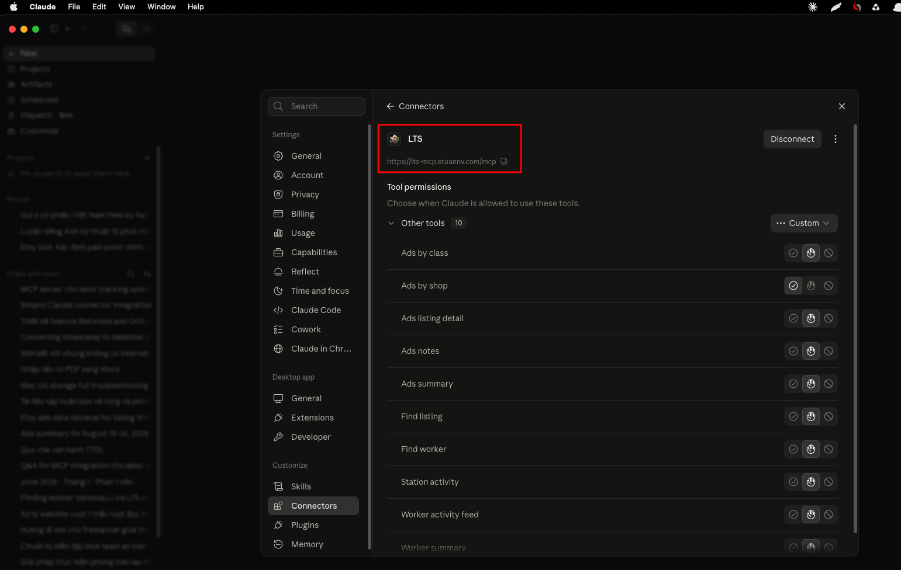

Table of Contents

- What is an MCP server?
- The project: from Django app to Claude connector
- Three ground rules before writing any code
- Lesson 1: Your ORM will explode in an async context
- Lesson 2: Run it as a Django management command
- Lesson 3: The read-only database user is fiddlier than it looks
- Lesson 4: The deployment is HTTPS-shaped, and OAuth is not optional
- Lesson 5: Proxy headers, or your server advertises 127.0.0.1
- Lesson 6: Reuse the query layer, match the existing UI
- Lesson 7: Verify assumptions against real data, not dev data
- Lesson 8: Give the model structured data and let it narrate
- Quick checklist for your own MCP connector
- Conclusion

## What is an MCP server?

MCP (Model Context Protocol) is the protocol that lets an assistant like Claude call tools that live outside the chat window. A "connector" in Claude is just an MCP server that the client is pointed at — the same mechanism that lets Claude read your Gmail, check your calendar, or query a payroll system. Once connected, Claude can call the server's tools mid-conversation and reason over whatever they return.

That last part is the interesting bit for anyone running an existing web app. You don't need to build a chatbot from scratch, and you don't need to teach Claude anything about your domain up front. You expose a handful of well-described tools on top of the app you already have, and Claude figures out when and how to call them.

## The project: from Django app to Claude connector

A client of mine runs a multi-store e-commerce operation. He was already living inside Claude for a lot of his day-to-day work — connectors wired up for payroll, for Upwork, and (through a third party) for his bank. One day he asked a simple-sounding question: could he do the same thing for his internal system, and just ask it plain-English questions the way he asks about payroll?

The "internal system" is a Labor Tracking System (LTS) I've maintained for a few years: a Django/MySQL app that tracks warehouse work, orders, stations, and — more recently — advertising data across several storefronts. That request turned into an MCP server that exposes ten read-only tools from a live production app to Claude Desktop.



This post is the set of things I wish I'd known before starting — the gotchas that cost me hours, and the design decisions I'd make again without hesitation.

## Three ground rules before writing any code

Before touching a single tool, I set three rules, and I'd start every similar project with the same three:

1. **Read-only, absolutely.** This is a production database with live users and a separate scraper writing into it at the same time. The MCP server only ever issues `SELECT`. No writes, no exceptions.
2. **Reuse the existing code, don't reimplement business logic.** The app already knows how to compute its numbers. Any tool that recomputes them independently will eventually drift and disagree with what the client sees in the web UI.
3. **No customer PII.** This server is about labor and ad performance. It never touches buyer names, addresses, or order contents.

I shipped it in thin slices — a foundation with two tools first, then deployment, then more tools — validating each slice end-to-end before expanding. That pacing mattered more than any single technical trick.

## Lesson 1: Your ORM will explode in an async context

The very first tool worked perfectly in a Django shell, then failed the moment I called it through the actual MCP protocol:

```
SynchronousOnlyOperation: You cannot call this from an async context —
use a thread or sync_to_async.
```

The MCP server framework runs each tool call in an async request context, and Django's ORM refuses synchronous database calls from inside that. The fix is to wrap every ORM-touching call:

```python
from asgiref.sync import sync_to_async
result = await sync_to_async(run_the_query, thread_sensitive=True)(args)
```

The lesson underneath the fix matters more than the fix itself: **unit-testing the query functions in isolation will not catch this.** It only shows up once you exercise the tool over the real protocol. I now treat "round-trip it over the live protocol" as the minimum bar for calling anything done — shell tests lie to you about the runtime environment.

## Lesson 2: Run it as a Django management command

Rather than standing up a separate service that re-implements settings, database config, and environment loading, I run the MCP server as a Django management command:

```
python manage.py run_mcp_server --host 127.0.0.1 --port 8765
```

Because it's a management command, `django.setup()` has already run — so the tools import the real models, reuse the real settings and `.env`, and call the same helper functions the web app uses. One environment, one source of truth. It also made deployment trivial: it's just another systemd service next to the ones already running.

## Lesson 3: The read-only database user is fiddlier than it looks

I wanted defense-in-depth: even if a bug ever tried to write, the database itself should refuse. So I created a dedicated `SELECT`-only MySQL user and routed all the MCP queries through a separate `DATABASES` alias.

Two things bit me, both worth writing on a sticky note:

- **Host matters.** The app connects to a managed MySQL instance over the network, not a local socket. A user created as `'ro_user'@'localhost'` will simply never match those connections — you need `@'%'` (or the specific host). I lost time to a user that existed but could never authenticate.
- **Auth plugin matters.** MySQL 8's default `caching_sha2_password` refuses to send credentials over an unencrypted connection. If your app connects without TLS (for example over a private VPC network), the read-only user needs `mysql_native_password`, or you'll get:
  ```
  Authentication plugin 'caching_sha2_password' reported error:
  Authentication requires secure connection.
  ```
  The main app user already used `mysql_native_password`; the new read-only user defaulted to the SHA-2 plugin, and that mismatch was the whole problem.

The deeper point: make the read-only alias **inherit the exact connection config of the working one** (same host, port, SSL options) and change only the username and password. Don't hand-write a fresh connection block — that's how the SSL and auth settings quietly drift apart.

## Lesson 4: The deployment is HTTPS-shaped, and OAuth is not optional

Claude's custom connectors are remote MCP servers reached over HTTPS. Two consequences shaped the whole deployment.

**You need real TLS.** I put the server behind the existing nginx as its own subdomain and terminated TLS there. If you're behind Cloudflare, mind the SSL mode: "Flexible" leaves the hop between Cloudflare and your origin unencrypted, and — more subtly — makes your app think requests arrived over plain HTTP even though the browser used HTTPS. That breaks OAuth redirects. I ended up on real end-to-end TLS (Let's Encrypt at the origin), then optionally Cloudflare Full (strict) with a scoped page rule.

**Auth depends on the client's plan.** This one surprised me. On a personal Claude plan, you cannot paste a static bearer token into a custom connector — Claude requires a full OAuth flow with PKCE. A static shared header is only an option on Team/Enterprise plans. So a "just put a token in the header" design that works fine for local testing turns out to be a dead end for the actual connector.

I delegated identity to Google via an OAuth-proxy provider, restricted to an explicit allowlist of emails, so connecting means "log in with Google" and only approved accounts get in. A few things I learned the hard way here:

- **Pin a patched library version.** MCP OAuth libraries have had confused-deputy vulnerabilities; check advisories and pin at or above the fix.
- **Enforce the allowlist in two independent places.** I wrapped the provider's token verifier to reject non-allowlisted emails, made startup fail-closed if that hook ever disappears in a future version, and re-checked at the tool layer. One private-attribute dependency should never be the only thing standing between the internet and your data.
- **Test the rejection, not just the acceptance.** "It works when I log in" proves nothing about the allowlist. I logged in with an email that *wasn't* on the list and confirmed the server refused it — and confirmed the refusal in the server logs, so I knew it was blocked for the right reason.

## Lesson 5: Proxy headers, or your server advertises 127.0.0.1

After TLS was up, the OAuth discovery metadata came back pointing every URL at `http://127.0.0.1:8765` instead of the public HTTPS address. Claude dutifully tried to connect to `127.0.0.1` — on the user's own machine — and failed.

The server sat behind nginx, so it only ever saw `http://127.0.0.1`. It needs to be told to trust the forwarded headers. For a uvicorn-based server that means `proxy_headers=True` and `forwarded_allow_ips="*"` (safe here because it only binds to localhost behind the proxy), plus making sure the public base URL is configured so the OAuth metadata advertises the right host. The tell-tale symptom — metadata endpoints returning `127.0.0.1` — is worth recognizing on sight.

## Lesson 6: Reuse the query layer, match the existing UI

The most valuable architectural decision was refusing to reimplement business logic. The advertising reports on the web UI are powered by one function that does a genuinely tricky thing: it allocates each listing's ad spend across the multiple product classes a listing can belong to, dividing by the class count so the parts sum back to the whole. Reproducing that logic inside the MCP tools would have been a slow, drifting disaster. Instead the tools **call the same function the page calls**, then aggregate on top of it. The result: tool numbers match what the client sees on the page, to the cent.

When "does the AI's number match my dashboard?" is the first thing your client will check, this is the difference between trust and abandonment.

## Lesson 7: Verify assumptions against real data, not dev data

This was the humbling lesson. While designing the ad-reporting tools, I built an elaborate mechanism to handle a subtle case: when the same listing runs several ad campaigns on the same day, some listing-level stats (like page visits) appeared to be *copied* onto each campaign's row rather than being independent — so summing them would multiply the real number. I inferred this from a single example in the dev database.

Then I looked at real production data, and the picture changed:

- The main storefront (Etsy) has **no campaign dimension at all** — one row per listing per day. The entire multi-campaign concern was moot for the data the client cares about most.
- The multi-campaign behavior only showed up in *imported* data from other marketplaces, which I'd been told not to over-index on.
- Meanwhile the *multi-class* case — which I'd treated as an edge case — was everywhere.

The correct design needed two different rules on two different axes: sum genuine per-campaign metrics (spend, clicks) across campaigns, but take a single representative value for copied listing-level stats — and always sum across the class axis, because that's a true division-then-resum. I only got there by reading actual rows. Dev data will confidently lead you to the wrong architecture; a few hundred real rows will correct you in five minutes.

I also built a reconciliation check directly into one of the tools: it computes a grand total two completely independent ways and reports whether they match. That check is what will catch it — at runtime, on real data — if the allocation logic is ever wrong for a case I couldn't test.

## Lesson 8: Give the model structured data and let it narrate

A recurring temptation is to have the tool return a pre-written sentence. Don't. The tools return **structured data plus explicit caveats**, and let Claude do the narration. The worker-utilization tool, for example, returns raw seconds *and* a `caveats` field explaining that clocked hours include vacation and sick time, so "unaccounted" time isn't necessarily slacking. Because the caveat travels *with the data*, Claude interprets the number responsibly when it answers — it won't tell the owner a worker was idle 40% of the time when the real story is a public holiday. For a system that measures people, baking the caution into the payload matters.

One more small thing that punches above its weight: **tool descriptions are part of the product.** The model uses them to decide which tool to call and how to fill the arguments. Vague descriptions mean the model picks the wrong tool or fumbles the date format. Clear ones — "this needs a username you can get from the find-worker tool; dates are YYYY-MM-DD" — make the whole thing feel smart.

## Quick checklist for your own MCP connector

If you're turning an existing app into a Claude connector, this is roughly the order I'd tackle things in:

- Decide read vs. write scope up front, and default to read-only unless you have a specific reason not to.
- Run the server inside your app's existing process/management-command machinery rather than standing up a parallel service.
- If you're adding a restricted database user, clone the working connection config and change only the credentials.
- Plan for real TLS and OAuth with PKCE from day one — don't design around a static bearer token if there's any chance of a personal-plan user.
- Configure proxy headers before you debug "connection failed" for the tenth time.
- Route every tool through the app's existing business-logic functions, never a parallel reimplementation.
- Validate every non-trivial assumption against production data, not the dev database.
- Return structured data and caveats, not prose, and write tool descriptions like they're user-facing documentation — because they are.

## Conclusion

The client now asks his internal system questions in the same window where he checks payroll and cash flow, which was the entire point. And when he asks "which listings lost money on ads last week," the answer matches his dashboard to the cent. That reconciliation, more than any clever code, is what made the whole project feel real rather than a demo.

If you're weighing whether an MCP server is worth building for your own app: it's less about protocol plumbing and more about deployment discipline — TLS, OAuth, a properly scoped database user, and proxy configuration will eat more of your time than the tools themselves. Budget for that up front and the rest goes quickly.

---
**See also:**
- [Why I Switched from GitHub Copilot to Claude](/posts/why-i-switched-from-github-copilot-to-claude/) — why Claude became my daily coding tool
- [AI Email Triage with n8n and Claude](/posts/ai-email-triage-n8n-claude/) — another project putting Claude to work on a real business workflow
