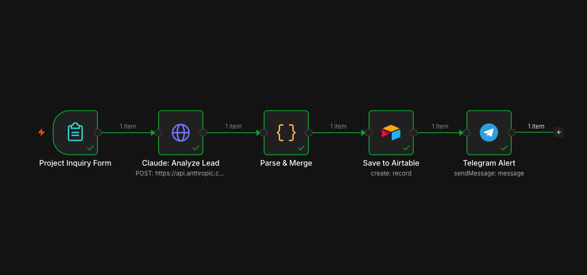

Table of Contents

- The problem
- The solution: a 5-node n8n workflow
- How it works
- What makes this different from a simple form
- Try it yourself
- The stack & cost
- Who this is for
- Variations I can build
- Want this for your business?

Every business with a contact form has the same problem: leads come in, sit in an email inbox, and by the time someone reads and qualifies them, the hot ones have already moved on.

I built a workflow that solves this. Every form submission is automatically analyzed by Claude AI, scored by quality, logged to Airtable, and pushed to Telegram — in under 30 seconds, with zero manual work. Want to see it live? Skip to the [Try it yourself](#try-it-yourself) section.

## The problem

Most contact forms just send an email notification. That email sits in an inbox alongside everything else, and someone still has to read each submission, decide whether it's worth following up, copy the data into a CRM by hand, and figure out the next step.

For a solo freelancer or small team handling 10–50 inquiries per week, that's 30–60 minutes of repetitive work every week. Worse, high-value leads get exactly the same slow treatment as spam.

## The solution: a 5-node n8n workflow

```
n8n Form (public URL)
       ↓
Claude AI — qualify lead + recommend next action
       ↓
Parse & structure JSON output
       ↓
Airtable — log all leads with AI scores
       ↓
Telegram — instant alert with lead-quality emoji
```

## How it works

**Step 1 — Form submission.** A clean contact form captures name, email, company, project description, and budget. No login required, works on any device.

**Step 2 — Claude AI analysis.** Every submission goes to Claude Haiku (fast and cheap — under $0.001 per analysis). Claude returns structured JSON:

```json
{
  "lead_quality": "hot",
  "project_type": "workflow_automation",
  "budget_usd": 1500,
  "timeline": "urgent",
  "summary": "GrowthCo needs HubSpot-to-Slack lead routing. Simple scope, realistic budget, clear timeline.",
  "suggested_action": "Schedule a 20-minute discovery call this week — strong fit for a 3-day build."
}
```

**Step 3 — Airtable logging.** Every lead lands in Airtable with all 12 fields filled automatically, giving the team a clean, sortable CRM view with no manual data entry.

**Step 4 — Telegram alert.** An instant notification fires with a lead-quality emoji:

- 🔥 HOT — follow up within the hour
- ⚡ WARM — follow up today
- ❄️ COLD — send a questionnaire first

The alert includes the AI summary and the suggested next action, so the right response happens immediately instead of hours later.

## What makes this different from a simple form

A basic contact form just emails you. This workflow:

- **Qualifies** the lead (hot / warm / cold) so you know where to focus first.
- **Extracts** budget and timeline even when written in natural language ("around $1k", "ASAP", "no rush").
- **Recommends** a specific next action tailored to each inquiry.
- **Logs everything** to a CRM automatically — no copy-paste.
- **Alerts instantly** on your phone, so you respond in minutes, not hours.

The difference between a 2-minute response to a hot lead and a 3-hour one is often the difference between winning and losing the deal.

## Try it yourself

I've left this workflow running live, so you can test it right now.

**Step 1 — Submit a test inquiry.** [Open the Project Inquiry Form](https://automation.etuannv.com/form/e22e7bc8-9840-416e-bf8d-71f117647172) and fill in any details, real or made up. Try two scenarios:

*Test A — hot lead (should score 🔥):*
- Name: your name
- Email: your email
- Company: any company name
- Description: *"We need an n8n automation to sync our HubSpot leads to Slack and send a daily report. 3 salespeople currently do this manually, 1 hour each morning. Ready to start next week."*
- Budget: $1500

*Test B — cold lead (should score ❄️):*
- Name: your name
- Email: your email
- Description: *"I need some automation help"*
- Budget: (leave empty)

**Step 2 — Watch it appear in Airtable.** [View the live Airtable](https://airtable.com/appFVeuyLArweHyTi/shrXQgx46zudpUMCw). Your submission shows up as a new row within 30 seconds, with all 12 fields filled by AI — including the quality score, budget extraction, and suggested action.

**Step 3 — Watch the demo video.** [Watch on YouTube](https://youtu.be/hYoz-02DN4Q) to see the full flow end to end: form submission → Claude analysis → Airtable row → Telegram alert, with both a hot lead and a cold lead so you can see how the AI differentiates.

**Step 4 — Get the code.** The full workflow is open source on GitHub — **[n8n-ai-lead-capture-airtable](https://github.com/etuannv/n8n-ai-lead-capture-airtable)**. Import the JSON, add your own credentials, and it's yours.

## The stack & cost

| Component | Tool | Cost |
|---|---|---|
| Workflow engine | n8n (self-hosted) | ~$5/month VPS |
| AI qualification | Claude Haiku (Anthropic) | <$1/month at 100 leads |
| CRM / database | Airtable | Free tier |
| Notifications | Telegram Bot | Free |
| **Total** | | **~$6/month** |

At $6/month, this replaces 30–60 minutes of manual lead sorting every week.

## Who this is for

This workflow fits any business or freelancer who gets inquiries through a contact form or email, wants to respond faster to high-value leads, is tired of copying form data into a spreadsheet or CRM by hand, and needs a simple way to prioritize follow-ups without a full sales team.

It's particularly effective for freelancers, agencies, consultants, SaaS startups, and small service businesses.

## Variations I can build

The same pattern adapts to many use cases:

- **Job application screener** — submissions scored by fit, logged to Airtable, notifying the hiring manager only for strong candidates.
- **Support ticket triage** — incoming tickets classified by urgency and type, then routed to the right team member.
- **Event registration qualifier** — attendee forms scored by ICP fit, with hot prospects flagged for sales outreach.
- **Vendor / partner inquiry handler** — partnership requests qualified and routed before anyone reads them.

All run on the same stack: n8n + Claude AI + your CRM of choice (Airtable, HubSpot, Google Sheets, Notion).

## Want this for your business?

If your team is spending time manually sorting leads, copying form data, or responding slowly because nothing is prioritized, this is a 1–3 day build.

[Message me on Upwork](https://www.upwork.com/freelancers/etuannv), tell me what your current form or inbox process looks like, and I'll tell you exactly how I'd automate it — and what it would cost.

---

*Tuan Nguyen is a Top Rated Plus automation developer on Upwork with 10+ years in Python and data engineering, building AI automation systems, n8n workflows, and RAG chatbots for clients worldwide.*

---
**See also:**
- [AI Email Triage — automatically sort and prioritize your inbox](https://etuannv.com/posts/ai-email-triage-n8n-claude/) — the same qualify-and-route pattern applied to email
- [Prompt Engineering in 5 Levels](https://etuannv.com/posts/prompt-engineering-5-levels/) — the Levels 1–5 prompt techniques this workflow relies on
- [Claude Code, Efficiently](https://etuannv.com/posts/claude-code-efficiently/) — how I build and ship automations like this one faster
