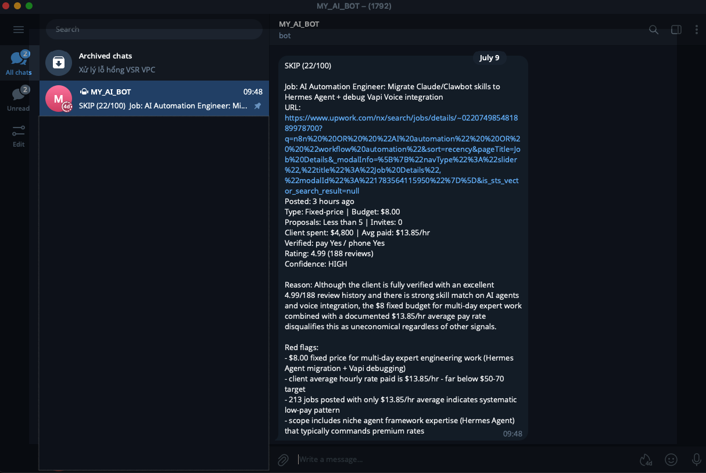

Phần lớn hướng dẫn prompt engineering chỉ cho bạn xem vài câu lệnh khôn khéo. Rồi bạn nhét prompt đó vào một workflow thật, chạy 200 lần, và phát hiện sự thật phũ phàng: nó đúng 85% số lần, và 15% còn lại âm thầm làm hỏng database của bạn.

Bài này là cuốn cẩm nang mình ước gì đã có từ đầu. Năm cấp độ, mỗi cấp thêm đúng một kỹ thuật, đúc rút từ những prompt mình thực sự chạy trong các workflow n8n phân loại email, chấm điểm lead và job.

Đọc một lần để học. Bookmark lại cho lúc phải debug prompt vào 11 giờ đêm.

## Trước khi bắt đầu: cấp độ nào dành cho bạn?

Các kỹ thuật này đến từ việc xây pipeline tự động, nhưng hầu hết đều hiệu quả tương đương khi bạn gõ thẳng vào Claude, ChatGPT hay Gemini. Đây là bảng phân chia để bạn biết cái nào lướt qua, cái nào cần học kỹ.

| Cấp độ | Cửa sổ chat | API / pipeline tự động |
|---|---|---|
| 1. Bốn phần | Có, dùng nguyên | Có |
| 2. System vs user | Có, ở dạng khác | Có |
| 3. Few-shot examples | Có, dùng nguyên | Có |
| 4. Chain of thought | Có, dùng nguyên | Có |
| 5. Validation và chốt bằng code | Không áp dụng | Bắt buộc |

**Cấp 1–4 là phổ quát.** Chúng khiến mọi model trả lời tốt hơn, dù là cửa sổ chat hay một lệnh gọi API.

**Cấp 2 trong chat trông khác đi.** "System prompt" tồn tại dưới những tên khác: Project Instructions trong Claude, Custom Instructions hoặc Custom GPT trong ChatGPT, Gems trong Gemini. Nguyên tắc thì y hệt — bất cứ thứ gì bạn phải gõ lại mỗi cuộc trò chuyện đều thuộc về đó, không phải trong tin nhắn.

**Một lưu ý về Cấp 4.** Các reasoning model hiện đại (Claude với extended thinking, dòng o của OpenAI, Gemini Thinking) đã tự suy luận bên trong. Ép chain-of-thought lên chúng chỉ tốn token vô ích. CoT thủ công vẫn quan trọng với các model nhanh và rẻ — Haiku, Flash, mini — đúng loại bạn chạy trong pipeline khối lượng lớn.

**Cấp 5 không tồn tại trong chat**, và lý do đáng nói thẳng ra: *trong cửa sổ chat, chính bạn là lớp validation.* Bạn đọc output, phát hiện chỗ vô lý, và yêu cầu sửa. Không có database nào bị hỏng cả.

Từ đó ta có nguyên tắc cho cả bài:

> **Sẽ có người đọc output trước khi nó gây ra hậu quả không?**
> **Có** → Cấp 1–4 là đủ.
> **Không** → Bạn cần Cấp 5.

Khoảnh khắc output của một LLM chảy thẳng vào Airtable, một CRM, một email gửi đi, hay một quyết định tự động, không còn ai kiểm tra bài làm của nó nữa. Đó là lúc "prompt đã nhờ tử tế rồi" không còn đủ tốt.

## Cấp 1 — Giải phẫu: Bốn phần

Mọi prompt đáng tin đều có bốn phần. Thiếu một phần là bạn sẽ thấy hậu quả.

```
[ROLE]        Model đóng vai gì trong bối cảnh này?
[TASK]        Nó phải làm chính xác điều gì?
[FORMAT]      Output nên trông như thế nào?
[CONSTRAINT]  Luật lệ và giới hạn là gì?
```

### Ví dụ: dở vs tốt

**Dở — một điều ước, không phải một prompt:**

```
Classify this email.
```

Model phải đoán: phân loại vào đâu? Trả về hình dạng gì? Có thêm giải thích không? Bạn sẽ nhận kết quả khác nhau mỗi lần chạy.

**Tốt — đủ cả bốn phần:**

```
You are an email triage assistant for a freelance developer.   [ROLE]

Read the email below and classify it.                          [TASK]

Respond with ONLY a JSON object:
{"category": "hot_lead|recruiter|spam|other",
 "priority": "high|medium|low"}                                [FORMAT]

No markdown, no explanation, output JSON only.                 [CONSTRAINT]
```

Cùng một model. Cùng một email. Độ tin cậy khác nhau một trời một vực.

### Ví dụ thứ hai: cái bẫy kiểu dữ liệu

Để ý con bug tinh vi này. Cái nào trong hai cái là đúng?

```
"should_bid": "true/false"      ← A
"should_bid": true | false      ← B
```

**B.** Ở phiên bản A, bạn bọc giá trị trong dấu nháy, nên model trả về cho bạn *chuỗi* `"true"`. Sau đó code chạy `if (result.should_bid)` — và chuỗi `"false"` lại là truthy trong JavaScript. Workflow của bạn giờ bid vào đúng những job bạn đã bảo nó bỏ qua.

Luôn khai báo kiểu chính xác: `number`, chứ không phải `"amount in USD"`.

## Cấp 2 — System vs User: Tách phần cố định khỏi phần thay đổi

Mọi lệnh gọi API tới LLM đều có hai chỗ:

```json
{
  "system": "...",
  "messages": [
    {"role": "user", "content": "..."}
  ]
}
```

Nguyên tắc rất đơn giản:

- **System** = những gì không bao giờ đổi giữa các lần gọi — vai trò, format, luật lệ
- **User** = những gì đổi mỗi lần gọi — chính email này, chính submission form này

### Ví dụ: chia đúng chỗ

**Sai — nhồi tất cả vào user:**

```
user: "You are an email assistant. Classify this email into
hot_lead, recruiter, or spam. Return JSON only. Here's the
email: 'Hi, we need help automating invoices, budget $1500...'"
```

Cách này chạy được, nhưng bạn gửi lại toàn bộ bộ chỉ dẫn ở mỗi lần gọi. Tốn thêm token, thêm chi phí, và khi chỉnh luật bạn phải động vào cả đoạn code dựng tin nhắn.

**Đúng — tách riêng:**

```
system: "You are an email triage assistant for a freelance
         developer. Classify each email.
         Respond with ONLY a JSON object:
         {"category": "hot_lead|recruiter|spam|other",
          "priority": "high|medium|low"}
         No markdown. JSON only."

user:   "Hi, we need help automating invoices, budget $1500..."
```

Giờ system prompt là một file config. Tin nhắn user là dữ liệu. Trong n8n, system prompt nằm trong node còn tin nhắn user được dựng từ `$json` — đúng kiểu tách bạch bạn muốn.

## Cấp 3 — Few-Shot Examples: Cho xem, đừng giải thích

Đây là kỹ thuật có đòn bẩy cao nhất, và cũng bị xài ít nhất.

Vấn đề: những từ như "hot lead" mang nghĩa cụ thể *với bạn*. Model không biết định nghĩa của bạn. Bạn có thể viết ba đoạn văn giải thích, hoặc bạn có thể cho nó xem hai ví dụ.

### Ví dụ: dạy một định nghĩa

**Không có few-shot:**

```
Classify lead quality as hot, warm, or cold.
```

Model tự bịa ra ngưỡng của riêng nó. Một yêu cầu $200 có thể là "hot" hôm thứ Hai và "warm" hôm thứ Ba.

**Có few-shot:**

```
Classify lead quality. Examples:

Input:  "Need automation help, no budget mentioned"
Output: {"lead_quality": "cold"}

Input:  "Need n8n for HubSpot sync, $1500, start next week"
Output: {"lead_quality": "hot"}

Input:  "Interested in automation, budget TBD, no rush"
Output: {"lead_quality": "warm"}
```

Ba dòng ví dụ ăn đứt ba đoạn văn giải thích. Trong workflow lead-capture của mình, thêm few-shot examples chính là thay đổi duy nhất khiến điểm số thôi trôi dạt giữa các lần chạy.

### Luật cho few-shot

- **Hai đến ba ví dụ.** Nhiều hơn chỉ tốn token với lợi ích giảm dần.
- **Bao các ca ở rìa, không phải ở giữa.** Cho xem những ca nhập nhằng, không phải những ca hiển nhiên.
- **Khớp đúng y format output thật của bạn.** Nếu ví dụ dùng nháy đơn mà parser của bạn cần JSON, bạn vừa dạy model phá vỡ pipeline của chính mình. Dùng `"nháy kép"`.
- **Đặt chúng vào `system`, không phải `user`.** Chúng là luật, không phải dữ liệu.

### Ví dụ đặt ở đâu

Thứ tự bên trong system prompt có ý nghĩa:

```
1. Role
2. Few-shot examples      ← đặt trước các bước suy luận
3. Reasoning steps
4. Format + constraints
```

Model đọc từ trên xuống. Cho nó thấy "làm xong" trông thế nào trước khi bảo nó suy nghĩ.

## Cấp 4 — Chain of Thought: Bắt nó suy luận trước khi trả lời

Với một tác vụ phân loại đơn giản, model có thể trả lời tức thì. Với một phán đoán có nhiều yếu tố cạnh tranh nhau, một câu trả lời tức thì chỉ là phỏng đoán.

Chain of Thought (CoT) buộc model làm việc qua từng bước trước khi chốt.

### Ví dụ: một quyết định với nhiều yếu tố

Xét việc chấm điểm một job trên Upwork. Có nên bid cái này không?

```
Title: Automation Engineer (Python, RAG, Backend)
Posted: 3 hours ago
Budget: $8.00 fixed-price, "Expert" level
Client: United Kingdom, 5.0 rating, 188 reviews,
        213 jobs posted, 96% hire rate,
        $4.8K total spent, $13.85/hr average rate paid
```

Hỏi "có nên bid không?" và model thấy một client đã xác minh, rating 5.0 ở Anh, post mới toanh và ít cạnh tranh. Nó nói có. Nó sai.

**Với CoT:**

```
Before outputting JSON, reason through these steps:
Step 1 - Skill match: Does this need n8n, AI automation,
         or Python? Score yes/partial/no.
Step 2 - Posted time: How old is the post?
Step 3 - Client pay quality: What is their average
         hourly rate paid? What have they spent?
Step 4 - Budget vs scope: Is the budget proportionate
         to the work described?
Step 5 - Competition: How many proposals?
Step 6 - Decision: Based on steps 1-5, bid or skip?

Then, and only then, output the JSON.
```

Giờ Bước 3 lôi ra `$13.85/hr average paid` và Bước 4 lôi ra `$8.00 cho công việc Expert nhiều ngày`. Phán quyết lật sang bỏ qua — vì đúng lý do.

Cụm **"Then, and only then"** (rồi, và chỉ khi đó) rất quan trọng. Không có nó, model có xu hướng bắt đầu viết câu trả lời khi vẫn đang suy luận, và bạn nhận được văn xuôi lẫn vào JSON.

### Khi nào KHÔNG dùng CoT

CoT không miễn phí. Nó tốn token và độ trễ, và nó dụ model phun ra văn suy luận bên cạnh JSON của bạn.

Bỏ qua nó khi:

- Tác vụ là phân loại đơn giản (workflow email triage của mình không có CoT — nó không cần)
- Bạn cần một phản hồi JSON gọn, tối giản
- Bạn dùng một model nhỏ và nhanh cho một tác vụ hẹp

Dùng nó khi quyết định thực sự có nhiều đầu vào cạnh tranh nhau.

## Cấp 5 — Production: Validation, phương án dự phòng, và không tin model

Cấp 1–4 làm một prompt *tốt*. Cấp 5 làm nó *sống sót khi va vào thực tế*.

Ba thứ cần thêm.

### 5a. Bước tự validate

Thêm một bước suy luận cuối bắt model tự kiểm tra output của chính nó:

```
Step 7 - Validate: Before outputting, check:
  - Is should_bid a boolean, not the string "true"?
  - Is bid_price a number, not "$500"?
  - Is opening_line an empty string when should_bid is false?
  - Are all 7 keys present?
  If any check fails, fix it before outputting.
```

Cách này bắt được chừng 80% các trường hợp format bị trôi. Còn 20% kia thì sao.

### 5b. Phương án dự phòng cho input rác

Người dùng thật sẽ dán vào form rỗng. API thật sẽ trả về trang bị cắt cụt. Hãy bảo model làm gì thay vì để nó tự ứng biến:

```
If the job description is under 20 words or has no
technical detail, return exactly:
{"should_bid": false, "score": 0, "confidence": "low",
 "bid_price": 0, "red_flags": ["insufficient information"],
 "reason": "Insufficient information to analyze.",
 "opening_line": ""}
```

Không có phần này, một input rỗng khiến model bịa ra một bản phân tích trông có vẻ hợp lý về một job không hề tồn tại. Ảo giác đầy tự tin còn tệ hơn một lỗi.

### 5c. Bài học quan trọng nhất: chốt luật cứng bằng code, không phải trong prompt

Đây là điều mình mất lâu nhất để học.

Bạn có thể viết `HARD RULE: if posted more than 48 hours ago, should_bid MUST be false` trong prompt. Model sẽ tuân theo — thường thường. Cỡ 95% số lần. Ở 5% khi job trông hoàn hảo ở mọi mặt khác, nó sẽ tự lý luận để lách qua luật của bạn.

**Prompt là một lời gợi ý. Code là một sự đảm bảo.**

Vậy nên mọi luật không thể thương lượng đều được chốt hai lần — một lần trong prompt (để model suy luận đúng), và một lần trong code sau khi phản hồi trả về:

```javascript
// The prompt asks nicely. This makes sure.

// Rule 1: stale post
const posted = String(ex.posted_time || '').toLowerCase();
const dayMatch = posted.match(/(\d+)\s*day/);
if (posted.includes('week') || (dayMatch && parseInt(dayMatch[1]) >= 2)) {
  ai.should_bid = false;
  ai.red_flags.push('posted over 48 hours ago');
}

// Rule 2: client underpays
const avgRate = parseFloat(String(ex.client_avg_hourly_paid || '')
                  .replace(/[^0-9.]/g, ''));
if (!isNaN(avgRate) && avgRate > 0 && avgRate < 20) {
  ai.should_bid = false;
  ai.red_flags.push(`client avg rate paid is $${avgRate} - below target`);
}

// Rule 3: payment not verified
if (!String(ex.payment_verified).toLowerCase().includes('yes')) {
  ai.should_bid = false;
  ai.red_flags.push('payment method not verified');
}
```

Và cũng làm sạch kiểu dữ liệu một cách phòng thủ, vì bước tự validate cũng không hoàn hảo:

```javascript
ai.should_bid = ai.should_bid === true || ai.should_bid === 'true';
ai.score = typeof ai.score === 'number' ? ai.score : parseInt(ai.score) || 0;
if (!Array.isArray(ai.red_flags)) ai.red_flags = [];
if (!['high','medium','low'].includes(ai.confidence)) ai.confidence = 'low';
```

**Đừng bao giờ để một phản hồi model tồi làm sập workflow — hoặc tệ hơn, lọt qua một cách âm thầm.**

### 5d. Parse một cách phòng thủ

Ngay cả khi đã bảo `output JSON only`, model thỉnh thoảng vẫn bọc output trong khối markdown hoặc thêm một câu ở đầu. Hãy bóc tách thay vì tin tưởng:

```javascript
const clean = raw.replace(/```json/gi, '').replace(/```/g, '').trim();
const match = clean.match(/\{[\s\S]*\}/);   // grab the JSON object
if (!match) throw new Error('No JSON found in response');
const ai = JSON.parse(match[0]);
```

## Một lưu ý về việc chọn tiêu chí

Có một quyết định thiết kế đáng nêu ra, vì nó là câu hỏi prompt engineering núp dưới lốt câu hỏi kinh doanh.

Khi xây bộ chấm điểm job, phản xạ đầu tiên của mình là chấm client theo quốc gia — mặc định rằng client từ một số vùng nhất định trả ít hơn. Đây là một heuristic phổ biến trong giới freelancer.

Nó cũng là một heuristic tồi, và ví dụ nước Anh ở trên cho thấy vì sao. Client đó ở Anh, đã xác minh, 4.99 sao qua 188 review — và trả $13.85/giờ cho một job "Expert" fixed-price $8. Một bộ lọc theo quốc gia sẽ chấm client đó *cao*.

Tín hiệu mình thực sự muốn là **hành vi**: `avg_hourly_rate_paid`, `total_spent`, `payment_verified`, `hire_rate`. Chúng đo trực tiếp thứ mình quan tâm thay vì dùng một proxy vừa kém chính xác vừa bất công.

**Bài học khái quát hóa:** khi một prompt cho ra kết quả bất ổn hoặc thấy sai sai, hãy kiểm tra xem bạn có đang bắt model chấm một *proxy* cho thứ bạn quan tâm thay vì chấm chính thứ đó. Đầu vào tốt hơn ăn đứt prompt khôn khéo hơn.

## Khi nào dùng cấp độ nào

| Tình huống | Cấp cần dùng |
|---|---|
| Câu hỏi một lần trong cửa sổ chat | 1 |
| Một prompt bạn gõ lại mỗi tuần trong chat | 1 + 2 (chuyển vào Project Instructions / Custom GPT / Gem) |
| Output chat sai giọng điệu hoặc sai hình dạng | 1 + 3 (dán hai ví dụ về thứ bạn muốn) |
| Hỏi model chat một phán đoán khó | 1 + 3 + 4 |
| Bất kỳ lệnh gọi API, bất kỳ workflow nào | 1 + 2 |
| Output không nhất quán giữa các lần chạy | 1 + 2 + 3 |
| Quyết định có nhiều yếu tố cạnh tranh | 1 + 2 + 3 + 4 |
| Phân loại đơn giản ở khối lượng lớn | 1 + 2 + 3, bỏ CoT (tiết kiệm token) |
| Bất cứ thứ gì ghi vào database hoặc CRM | Cả 5 |
| Luật kinh doanh không thể thương lượng | Cả 5, và **chốt luật bằng code** |

Hai heuristic bao được hầu hết trường hợp:

- **Nếu không ai đọc output trước khi nó hành động, bạn cần Cấp 5.**
- **Nếu một câu trả lời sai làm bạn mất tiền, bạn cần Cấp 5.**

Mọi thứ trước Cấp 5 chỉ là tư duy tốt, và nó cũng có ích trong cửa sổ chat.

## Bản rút gọn

Nếu bạn chỉ nhớ năm điều:

1. **Bốn phần.** Role, task, format, constraint. Khai báo kiểu dữ liệu chính xác.
2. **System là config. User là dữ liệu.** Đừng bao giờ trộn lẫn. Trong chat, "system" được gọi là Project Instructions.
3. **Hai ví dụ ăn đứt hai đoạn văn.** Đặt chúng trong system, trước các bước suy luận.
4. **CoT cho phán đoán, không phải cho phân loại.** Và nói "then, and only then, output the JSON."
5. **Prompt là gợi ý; code là đảm bảo.** Chốt luật cứng hai lần — nhưng chỉ khi không có ai đọc output.

Cấp 1–4 sẽ khiến bạn giỏi hơn ở mọi cửa sổ chat bạn mở. Cấp 5 là thứ tách một bản demo khỏi một thứ bạn có thể để chạy không cần trông.

## Xem các prompt này chạy thật

Mọi thứ ở trên đến từ những workflow mình chạy trong production. Mã nguồn để mở:

- **[n8n-ai-email-triage](https://github.com/etuannv/n8n-ai-email-triage)** — Cấp 1–3. Gmail → Claude → Sheets → Telegram. Phân loại đơn giản, không cần CoT.
- **[n8n-ai-lead-capture-airtable](https://github.com/etuannv/n8n-ai-lead-capture-airtable)** — Cấp 1–5. Form → Claude → Airtable → Telegram. [Thử form trực tiếp](https://automation.etuannv.com/form/e22e7bc8-9840-416e-bf8d-71f117647172) và xem submission của bạn được chấm điểm.

## Muốn xây thứ gì đó tương tự?

Nếu bạn đang gắn một LLM vào một workflow chạm tới dữ liệu thật — một CRM, một database, một quy trình chạm tới khách hàng — khoảng cách giữa một prompt demo mượt và một prompt chạy không cần trông suốt sáu tháng phần lớn nằm ở Cấp 5.

Đó chính là phần mình xây cho khách.

[Nhắn mình trên Upwork](https://www.upwork.com/freelancers/etuannv), mô tả thứ bạn đang muốn tự động hóa, và mình sẽ nói chính xác mình sẽ xây nó thế nào.

---

*Tuan Nguyen là automation developer Top Rated Plus trên Upwork với hơn 10 năm kinh nghiệm Python và data engineering, chuyên xây hệ thống AI automation, workflow n8n và chatbot RAG cho khách hàng toàn cầu.*

---
**Xem thêm:**
- [AI Thu Thập Lead — từ form đến CRM trong 30 giây](https://etuannv.com/vi/posts/n8n-ai-lead-capture-airtable/) — workflow Cấp 1–5 mà bài này lấy ví dụ từ đó
- [AI Email Triage — tự động phân loại và ưu tiên hộp thư của bạn](https://etuannv.com/vi/posts/ai-email-triage-n8n-claude/) — workflow phân loại Cấp 1–3
