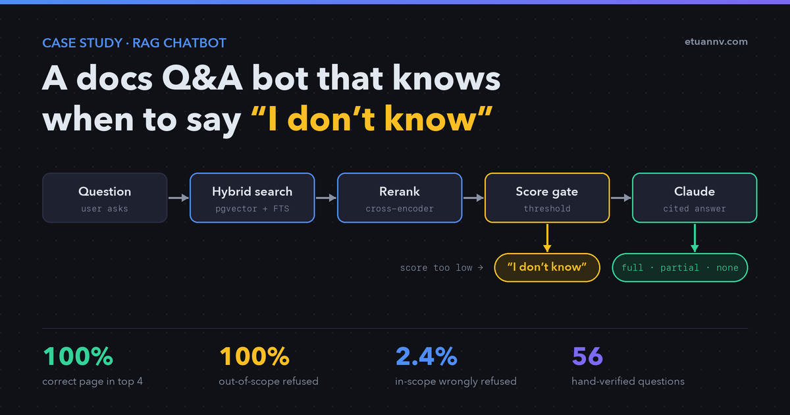

**Most RAG demos answer questions. The harder part is knowing when not
to answer.**

A support bot that confidently invents an API parameter is worse than no
bot at all. Users act on the wrong information, and your team ends up
spending time fixing it.

So when I built a question-answering system over the ShipStation API
documentation, I measured two things: how often it finds the right
answer, and how often it correctly refuses to answer.

Here are the final numbers from a 56-question benchmark I built and
hand-verified:

| Metric | Result |
|---|---|
| Correct page retrieved in top 4 | **100%** (41/41 questions) |
| Out-of-scope questions refused | **100%** (15/15) |
| In-scope questions wrongly refused | **2.4%** (1/41) |

## The problem

I integrate the ShipStation API for an e-commerce client. Their
documentation spans 50+ pages, covering rate limits, label creation,
international customs, batch processing, and more.

Even a simple question like "what happens when I hit the rate limit?"
can mean searching across several pages and piecing together information
from different sections.

A generic LLM is not a good fit here. It will happily invent endpoint
names that sound plausible.

I needed answers grounded in the actual documentation, a citation for
every claim, and a clear refusal when the documentation simply doesn't
cover something.

## What I built

I built a self-hosted retrieval-augmented generation pipeline:

-   **Ingestion** --- 52 documentation pages parsed into 611 chunks. I
    split them along heading boundaries rather than fixed token counts,
    and tagged each chunk with its heading breadcrumb.
-   **Retrieval** --- hybrid search combining dense vector similarity
    (pgvector on PostgreSQL) with PostgreSQL full-text search, fused by
    Reciprocal Rank Fusion.
-   **Reranking** --- a cross-encoder reorders the top candidates and,
    importantly, produces an absolute relevance score.
-   **Generation** --- Claude answers strictly from the retrieved
    excerpts, cites its sources, and reports its own coverage level.

**Stack:** Python, PostgreSQL + pgvector, OpenAI embeddings, Cohere
Rerank, Claude.

## Three layers of hallucination defense

A single relevance threshold is not enough. The benchmark made that
pretty clear.

**Layer 1 --- Score gate (code).**\
If the best-matching chunk scores below the threshold, the system
refuses without calling the model. A model that is never invoked cannot
invent anything.

This catches 12 of 15 out-of-scope questions at near-zero cost.

**Layer 2 --- Chunk filter (code).**\
Weak chunks are removed from the context even when the question passes
the gate.

On one question, this reduced the context from 4 chunks to 2 with no
loss of information in the answer. Less noise also means fewer chances
for the model to free-associate.

**Layer 3 --- Model self-assessment.**\
The model ends every reply with a machine-readable coverage verdict:
`full`, `partial`, or `none`.

The third layer is not redundant. One example makes that clear.

The question *"How do I enable two-factor authentication for my
ShipStation login?"* scored **0.746** --- higher than most legitimate
questions in my benchmark. The word "authentication" matches the API
authentication page very strongly, so the question looks relevant even
though it isn't.

No numeric threshold could separate it from a real question. The model
had to read the actual text and recognise that the page describes API
keys, not account-level 2FA.

Two more questions cleared the gate in the same way and were caught by
the model.

## How I measured it

I built a golden set of 56 questions and verified every expected answer
by hand against the documentation:

-   **30 "easy" questions** --- phrased close to the documentation's own
    wording.
-   **11 "hard" questions** --- phrased the way a real user writes,
    describing a symptom instead of naming a feature. *"The API stopped
    responding after I sent a few hundred requests in a row."* contains
    no mention of rate limits.
-   **15 out-of-scope questions** --- including near-misses designed to
    be genuinely difficult: questions that share vocabulary with the
    documentation but ask about something it does not cover.

I then compared four retrieval configurations on the same set, measuring
recall@4 and Mean Reciprocal Rank.

## What the measurement changed

**The easy questions were misleading.**

On questions phrased like the documentation, plain vector search scored
a perfect 1.000 MRR, and adding hybrid search actually made it worse.

The obvious conclusion was to simplify the pipeline.

But the hard questions gave a very different result. Vector search alone
dropped to 0.682. The correct page was still always in the top 4, but
usually at rank 2 or 3 rather than rank 1.

Hybrid search plus reranking reached **0.848**, a gain of +0.167.

Both components earn their place. The easy benchmark simply had nothing
left to improve, so it couldn't show the difference.

**Chunking mattered more than any model choice.**

Splitting along document structure instead of fixed token counts, and
prefixing each chunk with its heading breadcrumb, measurably tightened
retrieval. It also removed the hedging from one answer that had
previously been incomplete.

**Three "failures" turned out to be errors in my own test set.**

Each time a metric reported a problem, my first suspect was the ground
truth, not the system. In all three cases, the system was right and my
labels were wrong.

That's an easy mistake to make with RAG evaluations. If the ground truth
is based on unverified assumptions, you can end up with numbers that
look rigorous but don't mean much.

**Honest limitation:** 11 hard questions is a small sample.

A single question moving up one rank shifts MRR by roughly 0.045, so the
large gap (+0.167) is solid while the intermediate steps sit within the
noise. Expanding the hard set is the next improvement.

## What this means for your project

This approach can be used with almost any documentation set --- API
docs, internal policies, product manuals, or a support knowledge base.

What makes it production-ready rather than just another demo:

-   Every answer carries citations back to the source.
-   The system refuses rather than guesses, with measured refusal rates.
-   Thresholds are calibrated against your corpus, not copied from a
    tutorial.
-   The benchmark ships with it, so quality can be measured again after
    every change.

If you're evaluating a documentation assistant, the question to ask is
not just "can it answer?"

It's **"what happens when the answer isn't there?"**

And whether anyone can show you the number.

---

**See also:**
- [How I Built a Read-Only MCP Server to Connect a Django App to Claude](/posts/mcp-server-django-claude-connector/) — another production integration that puts Claude on top of real business data
- [AI Email Triage: Inbox to Action in Under 60 Seconds](/projects/ai-email-triage-n8n-claude/) — Claude classifying and routing real inbound email
- [Prompt Engineering in 5 Levels: From Toy Prompts to Production Pipelines](/posts/prompt-engineering-5-levels/) — how to write the kind of grounded, structured prompts this pipeline relies on

*Built on ShipStation's public API documentation as a working reference
implementation. Not affiliated with or endorsed by ShipStation.*
