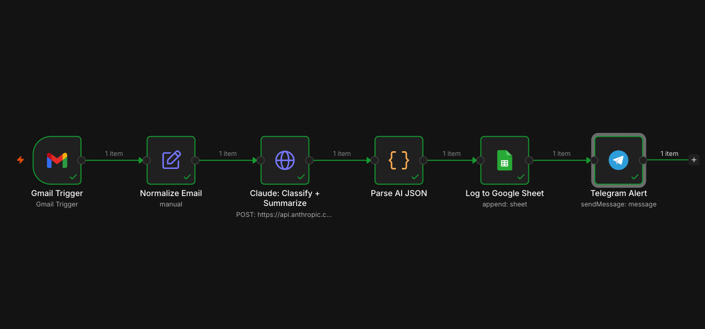

Mọi freelancer và founder tôi biết đều gặp cùng một vấn đề: hộp thư đến là một cái lỗ đen.

Lead nóng nằm cạnh spam của recruiter, nằm cạnh newsletter, nằm cạnh câu hỏi thật của khách hàng — và đến khi bạn sắp xếp xong hết, lead nóng đó đã thuê người khác rồi.

Tôi đã xây dựng một workflow để giải quyết vấn đề này. Đây là cách nó hoạt động chính xác, chi phí vận hành, và cách bạn có thể tự thiết lập.

🎥 **Xem demo trực tiếp:**



---

## Vấn đề

Phân loại email thủ công tốn kém hơn bạn nghĩ. Nếu bạn dành chỉ 20 phút mỗi ngày để sắp xếp và ưu tiên hộp thư, đó là:

- 1.5 giờ mỗi tuần
- 6 giờ mỗi tháng
- **72 giờ mỗi năm** — gần hai tuần làm việc đầy đủ

Và đó chỉ là chi phí thời gian. Chi phí *thực sự* là lead nóng bạn bỏ lỡ trong khi đang đọc một lời mời tuyển dụng spam.

---

## Giải pháp: Workflow n8n với 6 Node

Tôi xây dựng cái này trong n8n (self-hosted), gọi Claude AI qua API. Toàn bộ pipeline chạy tự động mỗi phút, chi phí xử lý dưới $0.01 mỗi email, và tốn dưới 60 giây từ khi nhận email đến khi có cảnh báo Telegram.

Đây là kiến trúc:

```
Gmail Trigger
     ↓
Normalize Email (trích xuất sender, subject, body)
     ↓
Claude AI (phân loại + ưu tiên + tóm tắt + soạn câu trả lời)
     ↓
Parse JSON (trích xuất output có cấu trúc)
     ↓
Google Sheets (ghi log mọi thứ)
     ↓
Telegram Alert (thông báo ngay lập tức)
```

### Node 1 — Gmail Trigger
Kiểm tra Gmail mỗi phút để tìm email mới. Không cần webhook, không cần thiết lập OAuth phức tạp ngoài việc xác thực một lần ban đầu.

### Node 2 — Normalize Email
Một Set node đơn giản trích xuất ba trường chúng ta cần: `senderEmail`, `subject`, và `body`. Node này xử lý sự không đồng nhất trong định dạng phản hồi của Gmail API giữa các loại email khác nhau.

### Node 3 — Claude AI (bộ não)
Đây là nơi điều kỳ diệu xảy ra. Tôi gửi một prompt có cấu trúc duy nhất tới Claude Haiku (model nhanh, rẻ — hoàn hảo cho các tác vụ phân loại) và yêu cầu nó trả về một object JSON với chính xác năm trường:

```json
{
  "category": "hot_lead",
  "priority": "high",
  "language": "en",
  "summary": "David from SwiftCargo needs invoice automation, budget $1,500, wants to start in 2 weeks.",
  "suggested_reply": "Hi David, this sounds like a great fit — I've built exactly this kind of system before. Are you free for a 20-minute call this week?"
}
```

Prompt này bắt buộc output JSON nghiêm ngặt (không có markdown fence, không có lời dẫn) để node tiếp theo có thể parse một cách đáng tin cậy. Các category gồm: `hot_lead`, `question`, `recruiter`, `spam`, `other`.

**Chi phí:** Claude Haiku xử lý một email thông thường với chi phí dưới $0.001. Ngay cả với 100 email/ngày, đó cũng chỉ dưới $3/tháng.

### Node 4 — Parse JSON
Một Code node loại bỏ bất kỳ định dạng markdown vô tình nào từ phản hồi của Claude và parse JSON một cách an toàn. Nó cũng gộp output của AI với metadata email gốc để các node tiếp theo có đủ thông tin cần thiết.

### Node 5 — Google Sheets
Thêm một dòng cho mỗi email với đầy đủ tám trường: `receivedAt`, `senderEmail`, `subject`, `category`, `priority`, `language`, `summary`, `suggested_reply`. Bảng tính trở thành một nhật ký kiểm tra sạch, có thể tìm kiếm cho mọi email đã xử lý.

### Node 6 — Telegram Alert
Gửi một thông báo được định dạng cho mỗi email. Trên điện thoại, tôi có thể nhìn thấy ngay:

```
🚨 hot_lead · priority: high · en
From: david@swiftcargo.com
Subject: Need help automating invoice processing

Summary: Logistics company, manual invoice entry,
budget $1,500, wants to start in 2 weeks.

✍️ Draft reply:
Hi David, this sounds like a great fit...
```

Tôi có thể trả lời trực tiếp từ Telegram trong dưới 30 giây — trước khi lead kịp refresh lại hộp thư của họ.

---

## Demo trực tiếp: Hai email test thực tế

### Test 1 — Bắt được Lead nóng theo thời gian thực

Tôi gửi email này vào Gmail của chính mình:

> **From:** david@swiftcargo.com
> **Subject:** Need help automating our invoice processing — budget ready
> **Body:** We're drowning in supplier invoices entered by hand. Budget ~$1,500. Can we start in two weeks?

Trong vòng 60 giây, Telegram báo cho tôi:
- Category: `hot_lead`
- Priority: `high`
- Câu trả lời soạn sẵn để gửi

### Test 2 — Lọc Spam tự động

Tôi gửi một email spam kiểu "bạn đã thắng $5,000,000" cổ điển. Workflow trả về chính xác:
- Category: `spam`
- Priority: `low`
- Không có thông báo gây nhiễu

AI không chỉ khớp từ khóa — nó hiểu ngữ cảnh. Đó là sự khác biệt giữa một bộ lọc dựa trên quy tắc và một LLM.

Bạn có thể xem cả hai test chạy từ đầu đến cuối trong video demo ở trên.

---

## Stack công nghệ & Chi phí

| Thành phần | Công cụ | Chi phí hàng tháng |
|---|---|---|
| Tự động hóa workflow | n8n (self-hosted) | ~$5 VPS |
| Phân loại AI | Claude Haiku (Anthropic) | < $3 với 100 email/ngày |
| Nguồn email | Gmail API | Miễn phí |
| Ghi log dữ liệu | Google Sheets API | Miễn phí |
| Thông báo | Telegram Bot API | Miễn phí |
| **Tổng** | | **< $8/tháng** |

---

## Điều này thực sự tiết kiệm được gì

Với một freelancer xử lý 30–50 email/ngày:

- **Thời gian tiết kiệm:** 15–20 phút sắp xếp thủ công mỗi ngày
- **Lead được giữ lại:** Không bỏ lỡ lead nóng nào trong giai đoạn bận rộn
- **Tốc độ phản hồi:** Từ vài giờ xuống dưới 2 phút cho email ưu tiên cao

Với một nhóm doanh nghiệp nhỏ dùng chung một hộp thư, con số này sẽ nhân lên nhiều lần.

---

## Bạn muốn có hệ thống này cho hộp thư của mình?

Đây là loại tự động hóa tôi xây dựng cho khách hàng trên Upwork — những hệ thống chạy âm thầm phía sau và chỉ ra điều quan trọng, để bạn tập trung vào công việc thực sự giúp doanh nghiệp phát triển.

Nếu nhóm của bạn đang mất thời gian cho công việc inbox lặp lại (hoặc tệ hơn, bỏ lỡ những tin nhắn quan trọng), [liên hệ tôi qua Upwork](https://www.upwork.com/freelancers/etuannv) và tôi sẽ nói chính xác cách tôi sẽ tự động hóa nó.

---

## Bạn muốn tự xây dựng nó?

Toàn bộ workflow là mã nguồn mở trên GitHub — **[n8n-ai-email-triage](https://github.com/etuannv/n8n-ai-email-triage)**. Import file JSON và bạn sẽ cần:

- n8n (self-hosted hoặc cloud)
- Anthropic API key (~$5 credit để bắt đầu)
- Tài khoản Gmail + Google Cloud project (miễn phí)
- Telegram bot (miễn phí, mất 2 phút qua @BotFather)
- Google Sheet

Thời gian thiết lập: khoảng 2 giờ cho người đã quen làm việc với API.

---

*Tuan Nguyen là lập trình viên tự động hóa Top Rated Plus trên Upwork với 10+ năm kinh nghiệm Python và kỹ thuật dữ liệu. Anh xây dựng hệ thống tự động hóa AI, workflow n8n, và RAG chatbot cho khách hàng trên toàn thế giới.*

*→ [Hồ sơ Upwork](https://www.upwork.com/freelancers/etuannv) · [Hồ sơ Freelancer](https://www.freelancer.com/u/etuannv)*

---
**Xem thêm:**
- [AI Thu Thập Lead — từ form đến CRM trong 30 giây](https://etuannv.com/vi/posts/n8n-ai-lead-capture-airtable/) — cùng mô hình phân loại-và-định-tuyến áp dụng cho lead từ form liên hệ
- [Prompt Engineering qua 5 cấp độ](https://etuannv.com/vi/posts/prompt-engineering-5-levels/) — các kỹ thuật prompt đằng sau bước phân loại bằng Claude của workflow này
- [Dùng Claude Code hiệu quả](https://etuannv.com/vi/posts/claude-code-efficiently/) — cách mình xây và ship những automation như thế này nhanh hơn
